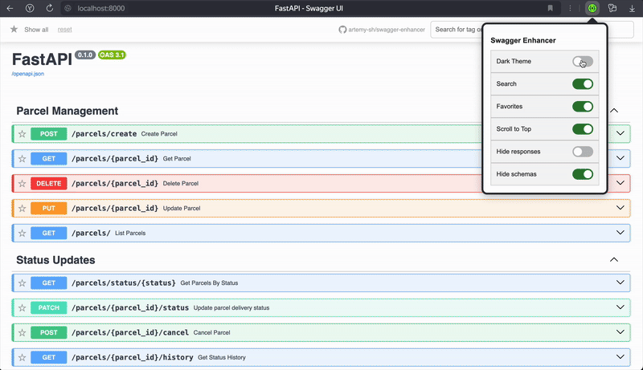
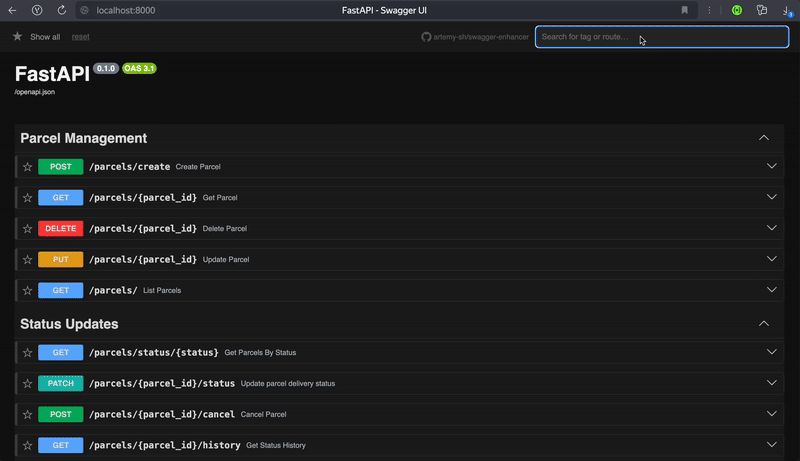
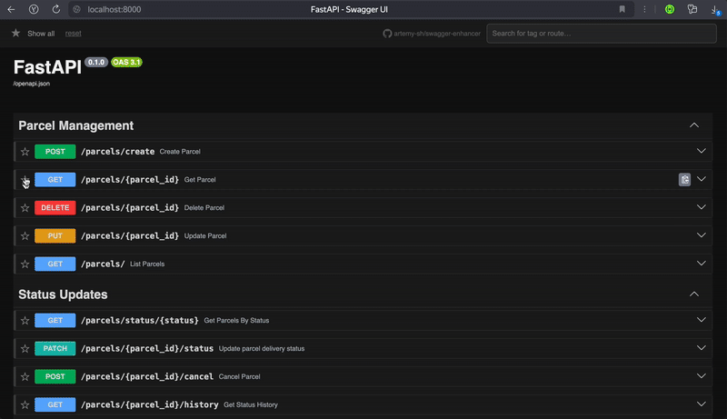

### Swagger Enhancer

[](README.md)
[](#требования)
[](#установка)
[](LICENSE)
[](#возможности)
[](#тестирование)

#### Содержание

* [Возможности](#возможности)
* [Требования](#требования)
* [Установка](#установка)
  * [Установка из Chrome Web Store](#установка-из-chrome-web-store)
  * [Ручная установка](#ручная-установка)
* [Быстрый старт](#быстрый-старт)
* [Архитектура](#архитектура)
* [Тестирование](#тестирование)
* [Контакты](#контакты)
* [Отчёт об ошибках](#отчёт-об-ошибках)
* [Лицензия](#лицензия)

---

**Swagger Enhancer** — расширение для браузеров на движке Chromium (Chrome, Edge, Яндекс.Браузер и др.) для улучшения интерфейса Swagger UI.

Добавляет тёмную тему, поиск по эндпоинтам, управление избранными, скрытие блоков ответов и схем, кнопку прокрутки вверх. Использует Manifest V3, настройки синхронизируются через `chrome.storage.sync`.

---

#### Возможности

* **Тёмная тема**
  Переключение между светлой и тёмной темой без перезагрузки страницы.

  

* **Поиск**
  Поиск по тегам и эндпоинтам с ранжированием результатов и кэшированием.

  

* **Избранное**
  Сохранение методов API в список избранных.
  Есть возможность исключать методы, например, чтобы отображать только новые.

  

* **Кнопка «Наверх»**
  Быстрая прокрутка к началу страницы при большом количестве эндпоинтов.

* **Скрытие стандартных ответов**
  Скрывает типовые HTTP-ответы (`200`, `400`, `404` и т.д.) для упрощения интерфейса.

* **Сворачивание схем**
  Автоматически скрывает блок `Schemas`, делая страницу компактнее.

* **Сохранение настроек**
  Настройки синхронизируются через `chrome.storage.sync` и применяются автоматически.

---

#### Требования

* **Браузер**: Chrome, Edge, Яндекс.Браузер и другие Chromium-браузеры
* **Версия Chromium**: 88+ (Manifest V3, `chrome.storage.sync`)
* **Swagger UI**: Страницы с паттернами `/docs`, `/swagger`, `/api-docs`, `/openapi`

---

### Установка

#### Установка из Chrome Web Store

> [](https://chromewebstore.google.com/detail/swagger-enhancer/dnadagbnobcgafbdebbabcgicfkpciam)
> 
> Перейдите на [страницу Chrome Web Store](https://chromewebstore.google.com/detail/swagger-enhancer/dnadagbnobcgafbdebbabcgicfkpciam) и нажмите **Добавить в Chrome**.
> Расширение будет установлено, и иконка появится в панели браузера.

#### Ручная установка

1. Клонируйте репозиторий или скачайте архив:

   ```bash
   git clone https://github.com/artemy-sh/swagger-enhancer.git
   ```

2. Откройте страницу расширений:

   * В Chrome, Яндекс.Браузере, Edge:
     Введите в адресной строке `chrome://extensions/` и нажмите Enter.

3. Включите **Режим разработчика** (переключатель в правом верхнем углу).

4. Нажмите **Load unpacked** / **Загрузить распакованное расширение**.

5. Выберите папку `swagger-enhancer/`.

6. Иконка расширения появится в панели браузера — установка завершена.

---

### Быстрый старт

1. Перейдите на страницу с **Swagger UI**.

2. Нажмите на иконку **Swagger Enhancer**.

3. В открывшемся окне включите нужные опции:
   `Dark Theme`, `Hide Schemas`, `Scroll to Top`, `Favorites` и др.

4. Настройки сохраняются автоматически и работают на всех вкладках Swagger UI.

---

### Архитектура

#### **Модульная структура**
```
swagger-enhancer/
├── js/utils.js              # Общие утилиты и класс BaseFeature
├── js/feature_manager.js    # Централизованное управление фичами
├── js/main.js              # Точка входа приложения
├── js/theme.js             # Фича тёмной темы
├── js/search.js            # Фича поиска по эндпоинтам
├── js/favorites.js         # Фича управления избранными
├── js/scroll_top.js        # Фича прокрутки наверх
├── js/hide_responses.js    # Фича скрытия ответов
├── js/hide_schemas.js      # Фича скрытия схем
├── js/github_link.js       # Фича ссылки на GitHub
├── js/floating_menu.js     # Фича плавающего меню
└── css/variables.css       # Централизованные CSS переменные
```

#### **Ключевые компоненты**

* **`BaseFeature`** — унифицированный базовый класс для всех фич с управлением жизненным циклом
* **`FeatureManager`** — централизованная система регистрации и управления фичами
* **`SwaggerEnhancerUtils`** — общие утилиты для storage, DOM и messaging
* **CSS Variables** — централизованная система темизации с поддержкой тёмного режима

### Тестирование

#### **Система тестирования**
```
js/test_runner.js      # Фреймворк тестирования
js/page_test_functions.js  # Функции контекста страницы для доступа из консоли
```

#### **Покрытие тестами**

* **Основные тесты** — Загрузка расширения и доступность фич
* **Тесты фич** — Функциональность переключения фич
* **DOM тесты** — Наличие UI элементов
* **CSS тесты** — Проверка загрузки стилей
* **Тесты производительности** — Базовые проверки производительности
* **Тесты хранилища** — Функциональность Chrome storage API

#### **Использование**
```javascript
// Запустить все тесты (одна команда)
runTests();
```

**Примечание:** Дождитесь сообщения "Swagger Enhancer: Ready" перед запуском тестов.

---

### Контакты

* **Автор**: Артемий Шалыгин
* **Email**: [artemy.sh@gmail.com](mailto:artemy.sh@gmail.com)
* **Telegram**: [@artemy\_sh](https://t.me/artemy_sh)

---

### Отчёт об ошибках

Если вы нашли баг или хотите предложить улучшение — создайте [issue](https://github.com/artemy-sh/swagger-enhancer/issues)

---

### Лицензия

[MIT License](/LICENSE)
