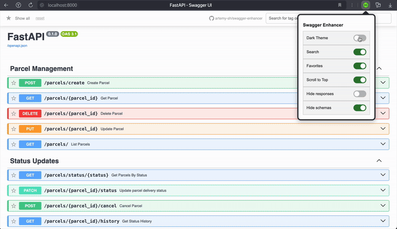
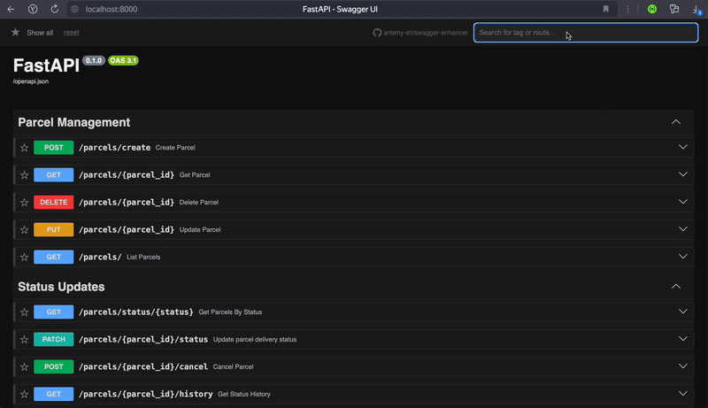
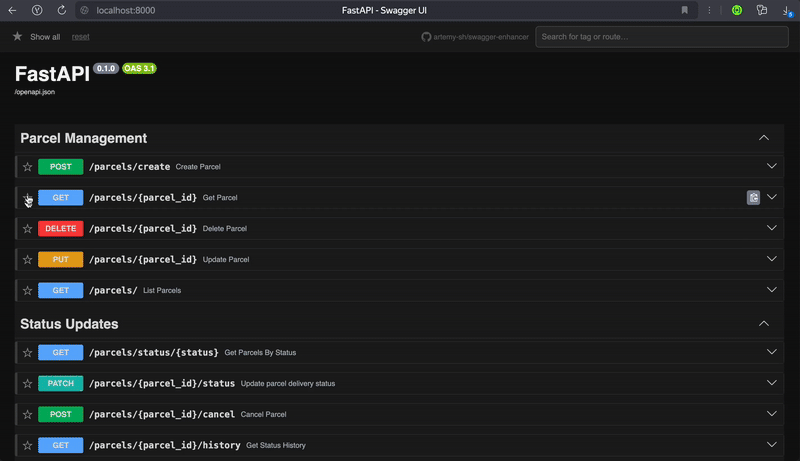

### Swagger Enhancer

[](README.md)
[](#требования)
[](#установка)
[](LICENSE)
[](#возможности)
[](#тестирование)

#### Содержание

* [Возможности](#возможности)
* [Требования](#требования)
* [Установка](#установка)
  * [Установка из Chrome Web Store](#установка-из-chrome-web-store)
  * [Ручная установка](#ручная-установка)
* [Быстрый старт](#быстрый-старт)
* [Архитектура](#архитектура)
* [Тестирование](#тестирование)
* [Контакты](#контакты)
* [Отчёт об ошибках](#отчёт-об-ошибках)
* [Лицензия](#лицензия)

---

**Swagger Enhancer** — расширение для браузеров на движке Chromium (Chrome, Edge, Яндекс.Браузер и др.) для улучшения интерфейса Swagger UI.

Добавляет тёмную тему, поиск по эндпоинтам, управление избранными, скрытие блоков ответов и схем, кнопку прокрутки вверх. Использует Manifest V3, настройки синхронизируются через `chrome.storage.sync`.

---

#### Возможности

* **Тёмная тема**
  Переключение между светлой и тёмной темой без перезагрузки страницы.

  

* **Поиск**
  Поиск по всей спецификации с учётом текущего фильтра избранного, включая свёрнутые группы и методы за пределами экрана. Ищет по тегам, пути, HTTP-методу, краткому и полному описанию, operationId. Выбор результата раскрывает нужную группу/операцию и прокручивает к ней. В выпадающем списке показаны десять наиболее подходящих результатов.

  

* **Избранное**
  Сохранение методов API в список избранных.
  Есть возможность исключать методы, например, чтобы отображать только новые.

  

* **Кнопка «Наверх»**
  Быстрая прокрутка к началу страницы при большом количестве эндпоинтов.

* **Копирование полного URL**
  Включается отдельной настройкой `Copy full URL` (по умолчанию выключена). Слева от штатного копирования пути появляются две кнопки: значок документа копирует ссылку на документацию операции (`docs#/tag/operationId`), значок ссылки — протокол, хост и порт текущей страницы вместе с путём роута, сохраняя параметры вроде `{id}`. После успешного копирования кнопка синеет и на две секунды появляется подсказка «Copied!». Кнопки видны при наведении на роут или фокусе с клавиатуры; штатная кнопка по-прежнему копирует только путь. Работает через адаптер стандартного SwaggerUIBundle.

* **Авторизация в шапке**
  Открывает стандартное окно авторизации Swagger из закреплённой шапки при любом положении прокрутки. Включается переключателем `Authorize in header` в настройках расширения (по умолчанию выключен). Обе кнопки — исходная в Swagger и кнопка в шапке — красные до входа, после — зелёные с подписью `Authorized: client_id` (или username, если client_id отсутствует). Если Swagger не предоставляет идентификатор, показывается `Authorized`. Кнопка появляется только при наличии авторизации у API. Замки методов: закрытый красный без авторизации, открытый зелёный после авторизации для конкретного метода. Все эти изменения управляются одной настройкой; при выключении возвращаются исходные кнопки и иконки Swagger.

* **Скрытие стандартных ответов**
  Скрывает типовые HTTP-ответы (`200`, `400`, `404` и т.д.) для упрощения интерфейса.

* **Сворачивание схем**
  Автоматически скрывает блок `Schemas`, делая страницу компактнее.

* **Сохранение настроек**
  Настройки синхронизируются через `chrome.storage.sync` и применяются автоматически.

---

#### Требования

* **Браузер**: Chrome, Edge, Яндекс.Браузер и другие Chromium-браузеры
* **Версия Chromium**: 88+ (Manifest V3, `chrome.storage.sync`)
* **Swagger UI**: Страницы с паттернами `/docs`, `/swagger`, `/api-docs`, `/openapi`

---

### Установка

#### Установка из Chrome Web Store

> [](https://chromewebstore.google.com/detail/swagger-enhancer/dnadagbnobcgafbdebbabcgicfkpciam)
> 
> Перейдите на [страницу Chrome Web Store](https://chromewebstore.google.com/detail/swagger-enhancer/dnadagbnobcgafbdebbabcgicfkpciam) и нажмите **Добавить в Chrome**.
> Расширение будет установлено, и иконка появится в панели браузера.

#### Ручная установка

1. Клонируйте репозиторий или скачайте архив:

   ```bash
   git clone https://github.com/artemy-sh/swagger-enhancer.git
   ```

2. Откройте страницу расширений:

   * В Chrome, Яндекс.Браузере, Edge:
     Введите в адресной строке `chrome://extensions/` и нажмите Enter.

3. Включите **Режим разработчика** (переключатель в правом верхнем углу).

4. Нажмите **Load unpacked** / **Загрузить распакованное расширение**.

5. Выберите папку `swagger-enhancer/`.

6. Иконка расширения появится в панели браузера — установка завершена.

---

### Быстрый старт

1. Перейдите на страницу с **Swagger UI**.

2. Нажмите на иконку **Swagger Enhancer**.

3. В открывшемся окне включите нужные опции:
   `Dark Theme`, `Hide Schemas`, `Scroll to Top`, `Favorites` и др.

4. Настройки сохраняются автоматически и работают на всех вкладках Swagger UI.

---

### Архитектура

#### **Модульная структура**
```
swagger-enhancer/
├── js/utils.js              # Общие утилиты и класс BaseFeature
├── js/feature_manager.js    # Централизованное управление фичами
├── js/main.js              # Точка входа приложения
├── js/theme.js             # Фича тёмной темы
├── js/search.js            # Фича поиска по эндпоинтам
├── js/favorites.js         # Фича управления избранными
├── js/authorize.js         # Кнопка авторизации в шапке
├── js/scroll_top.js        # Фича прокрутки наверх
├── js/hide_responses.js    # Фича скрытия ответов
├── js/hide_schemas.js      # Фича скрытия схем
├── js/github_link.js       # Фича ссылки на GitHub
├── js/floating_menu.js     # Фича плавающего меню
└── css/variables.css       # Централизованные CSS переменные
```

#### **Ключевые компоненты**

* **`BaseFeature`** — унифицированный базовый класс для всех фич с управлением жизненным циклом
* **`FeatureManager`** — централизованная система регистрации и управления фичами
* **`SwaggerEnhancerUtils`** — общие утилиты для storage, DOM и messaging
* **CSS Variables** — централизованная система темизации с поддержкой тёмного режима

### Тестирование

Только для разработки (Node.js 20.19+ и npm):

```bash
npm ci
npm test
npx playwright install chromium
npm run test:browser
```

`npm test` запускает 53 тестов в Node без браузера: DOM-регрессии с имитацией Chrome API и интеграционные проверки настоящих селекторов Swagger UI 4/5 на спецификации из 400 методов. Проверяются режимы и массовый выбор избранного, поиск по всей спецификации и переходы, обновление кеша, конфиденциальность и настройка авторизации, отступы иконок, ошибки сохранения popup, схемы, live-ответы, прокрутка и гонки инициализации/очистки.

`npm run test:browser` — отдельный необязательный набор. Он загружает настоящее расширение во временный профиль Chromium и проверяет его на локальном Swagger UI и тестовом API: popup, синхронизацию настроек между вкладками, сохранение избранного, поиск, схемы, ответы Execute и прокрутку вверх. Отдельный сценарий использует 400 методов в 20 группах: виртуализация, избранное за пределами экрана, все режимы фильтра, массовый выбор и сброс. Запросов к рабочим API нет. Node-тесты не проверяют фактическую геометрию страницы и прокрутки в браузере.

Версии Swagger UI 4 и 5 закреплены в `package-lock.json`; проверка не гарантирует совместимость со всеми модификациями Swagger UI и старыми браузерами. Переменная `SWAGGER_TEST_CHROMIUM` позволяет указать существующий совместимый исполняемый файл Chromium.

Для стандартного SwaggerUIBundle фильтр избранного подключается через плагин Swagger до рендеринга списка; это поддерживает виртуализацию больших спецификаций. Адаптер js/favorites_bridge.js также передаёт поиску индекс отфильтрованной спецификации и выполняет переходы через layout actions Swagger. Он работает в MAIN-контексте страницы без доступа к Chrome API. В нестандартных сборках, не публикующих SwaggerUIBundle, остаётся DOM-fallback: поиск ограничен смонтированными методами, виртуальные списки не поддерживаются.

Тесты не внедряются в посещаемые страницы. В архив для стора включайте только файлы расширения (`manifest.json`, `popup.html`, `js/`, `css/`, `assets/`), исключая `js/test_runner.js` и `js/page_test_functions.js`. Не включайте `node_modules/` и `tests/`. Перед новой публикацией нужно увеличить версию в manifest.

---

### Контакты

* **Автор**: Артемий Шалыгин
* **Email**: [artemy.sh@gmail.com](mailto:artemy.sh@gmail.com)
* **Telegram**: [@artemy\_sh](https://t.me/artemy_sh)

---

### Отчёт об ошибках

Если вы нашли баг или хотите предложить улучшение — создайте [issue](https://github.com/artemy-sh/swagger-enhancer/issues)

---

### Лицензия

[MIT License](/LICENSE)
