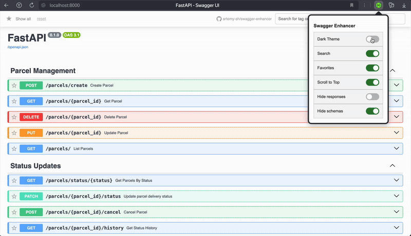

### Swagger Enhancer

[](README.md)
[](#требования)
[](#установка)
[](LICENSE)
[](#описание)
[](#история-версий)

#### Содержание

* [Описание](#описание)
* [Возможности](#возможности)
* [Требования](#требования)
* [Установка](#установка)
  * [Установка из Chrome Web Store](#установка-из-chrome-web-store)
  * [Ручная установка](#ручная-установка)
* [Быстрый старт](#быстрый-старт)
* [Контакты](#контакты)
* [Отчёт об ошибках](#отчёт-об-ошибках)
* [Лицензия](#лицензия)

---

**Swagger Enhancer** — расширение для браузеров на движке Chromium (Chrome, Яндекс.Браузер и др.), предназначенное для расширения возможностей стандартного интерфейса Swagger UI.

Добавляет пользовательские настройки интерфейса, включая поддержку тёмной темы, строку поиска, скрытие блоков ответов и схем, кнопку прокрутки вверх и избранные эндпоинты. Все настройки сохраняются автоматически и применяются при открытии страниц с Swagger UI.

---

#### Возможности

* **Тёмная тема**
  Переключение между светлой и тёмной темой без перезагрузки страницы.

  

* **Строка поиска**
  Быстрый поиск по тегам и названиям эндпоинтов.

  

* **Избранное**
  Сохранение методов API в список избранных.
  Есть возможность исключать методы, например, чтобы отображать только новые.

  

* **Кнопка «Наверх»**
  Быстрая прокрутка к началу страницы при большом количестве эндпоинтов.

* **Скрытие стандартных ответов**
  Скрывает типовые HTTP-ответы (`200`, `400`, `404` и т.д.) для упрощения интерфейса.

* **Сворачивание схем**
  Автоматически скрывает блок `Schemas`, делая страницу компактнее.

* **Сохранение настроек**
  Все изменения сохраняются в `chrome.storage` и применяются автоматически.

---

#### Требования

* **Браузер**: Chrome, Edge, Яндекс.Браузер и другие Chromium-браузеры
* **Версия Chromium**: 88+ (поддержка `chrome.storage.sync`, ES6+)
* **Swagger UI**: Любая страница с Swagger UI (`/docs`)

---

### Установка

#### Установка из Opera Addons

> https://addons.opera.com/ru/extensions/
> 
> Откройте страницу расширения и нажмите **Add to Browser**.
> Иконка появится в панели браузера.

#### Ручная установка

1. Клонируйте репозиторий или скачайте архив:

   ```bash
   git clone https://github.com/artemy-sh/swagger-enhancer.git
   ```

2. Откройте страницу расширений:

   * В Chrome, Яндекс.Браузере, Edge:
     Введите в адресной строке `chrome://extensions/` и нажмите Enter.

3. Включите **Режим разработчика** (переключатель в правом верхнем углу).

4. Нажмите **Load unpacked** / **Загрузить распакованное расширение**.

5. Выберите папку `swagger-enhancer/`.

6. Иконка расширения появится в панели браузера — установка завершена.

---

### Быстрый старт

1. Перейдите на страницу с **Swagger UI**.

2. Нажмите на иконку **Swagger Enhancer**.

3. В открывшемся окне включите нужные опции:
   `Dark Theme`, `Hide Schemas`, `Scroll to Top`, `Favorites` и др.

4. Настройки сохраняются автоматически и работают на всех вкладках Swagger UI.

---

### Контакты

* **Автор**: Артемий Шалыгин
* **Email**: [artemy.sh@gmail.com](mailto:artemy.sh@gmail.com)
* **Telegram**: [@artemy\_sh](https://t.me/artemy_sh)

---

### Отчёт об ошибках

Если вы нашли баг или хотите предложить улучшение — создайте [issue](https://github.com/artemy-sh/swagger-enhancer/issues)

---

### Лицензия

[MIT License](/LICENSE)
